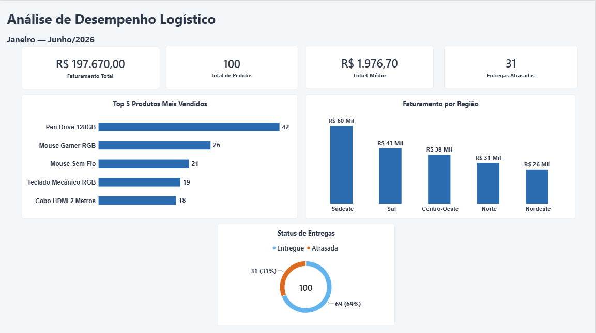
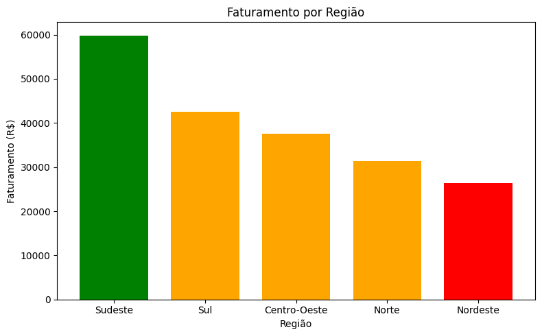
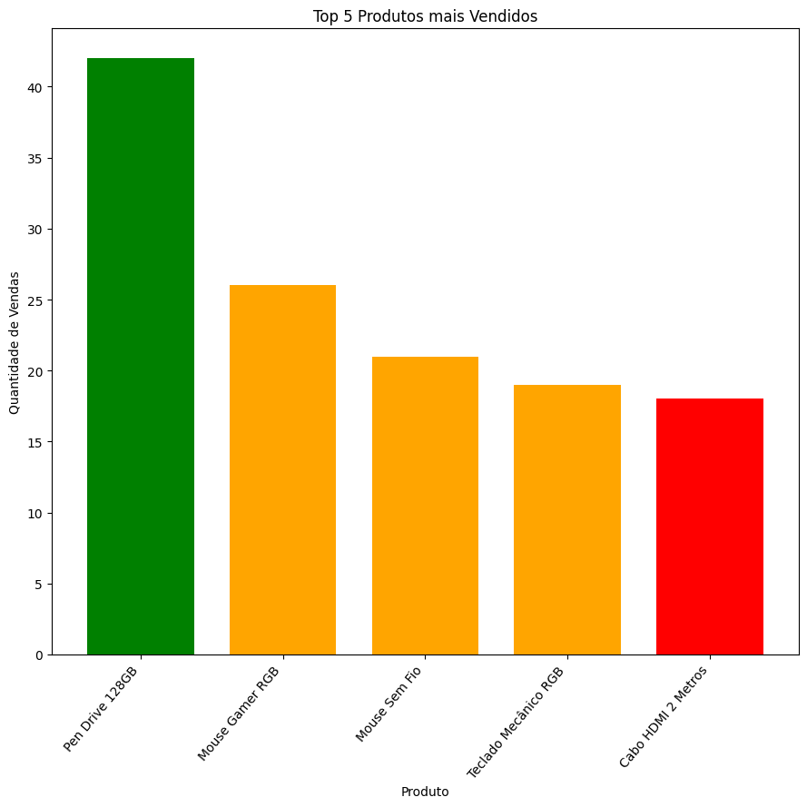
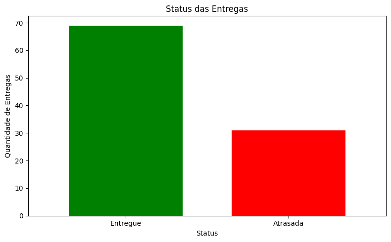

# Análise de Logística


## Sobre o Projeto

Projeto de análise de dados desenvolvido para explorar informações relacionadas a vendas e operações logísticas.

O projeto utiliza dados fictícios de produtos, clientes, pedidos e entregas para analisar faturamento, produtos mais vendidos, desempenho por região e situação das entregas.

Os dados foram analisados utilizando **Python**, com Pandas, NumPy e Matplotlib, e posteriormente utilizados na construção de um dashboard no **Power BI**.

O projeto foi desenvolvido com finalidade educacional e de portfólio, visando praticar análise exploratória, manipulação de dados, visualização e construção de dashboards.

## Objetivos

- Analisar o faturamento dos pedidos;
- Identificar os produtos mais vendidos;
- Comparar o faturamento entre regiões;
- Analisar o desempenho das entregas;
- Identificar entregas atrasadas;
- Praticar análise de dados com Python;
- Desenvolver um dashboard no Power BI.

## Dados

O projeto utiliza um dataset fictício estruturado em quatro tabelas relacionadas:

- **PRODUTOS** — informações dos produtos comercializados;
- **CLIENTES** — informações dos clientes;
- **PEDIDOS** — registros das vendas realizadas;
- **ENTREGAS** — informações sobre as entregas dos pedidos.

Ao todo, foram utilizados **30 produtos, 50 clientes, 100 pedidos e 100 entregas**.

## Análise

Foram analisados indicadores relacionados a:

- Faturamento total;
- Ticket médio;
- Produtos mais vendidos;
- Faturamento por região;
- Entregas atrasadas;
- Percentual de atrasos.

A análise apresentou um faturamento total de **R$ 197.670,00** em **100 pedidos**, com ticket médio de **R$ 1.976,70**.

O **Pen Drive 128GB** foi o produto com maior quantidade de unidades vendidas, com **42 unidades**.

O **Sudeste** apresentou o maior faturamento, com **R$ 59.850,00**, enquanto o **Nordeste** apresentou o menor, com **R$ 26.300,00**.

Das 100 entregas analisadas, **31 foram atrasadas**, representando **31% do total**.

## Demonstração

### Dashboard de Logística



*Dashboard desenvolvido no Power BI contendo os principais indicadores e resultados da análise.*

### Faturamento por Região



*Faturamento total distribuído entre as regiões.*

### Top 5 Produtos Mais Vendidos



*Produtos com maior quantidade de unidades vendidas.*

### Status das Entregas



*Distribuição das entregas entre pedidos entregues e atrasados.*

## Metodologia

O projeto foi desenvolvido em quatro etapas principais:

1. **Preparação dos dados** — criação e organização do dataset em Excel;
2. **Análise exploratória** — manipulação e análise dos dados com Python;
3. **Visualização** — criação de gráficos utilizando Matplotlib;
4. **Dashboard** — modelagem dos dados e criação de indicadores e visualizações no Power BI.

## Tecnologias e Ferramentas

- **Python**
- **Pandas**
- **NumPy**
- **Matplotlib**
- **Jupyter Notebook**
- **OpenPyXL**
- **Excel**
- **Power BI**
- **DAX**
- **Visual Studio Code**

## Estrutura do Projeto

```text
analise_logistica/
│
├── dados/
│   └── analise_logistica_dataset.xlsx
│      
├── documentação/
│   ├── planejamento.md
│   │  
│   ├── metodologia.md
│   │  
│   └── resultados.md
│
├── imagens/
│   ├── imagem_analise_logistica_dashboard.png
│   │ 
│   ├── visualizacao_faturamento_por_regiao.png
│   │
│   ├── visualizacao_status_entregas.png
│   │
│   └── visualizacao_top_5_produtos_vendidos.png
│
├── power_bi/
│   └── analise_logistica_dashboard.pbix
│      
└── python/
    ├── analise_exploratoria.ipynb
    │
    └── analise_visualizacoes.ipynb
````

## Documentação

A documentação complementar está disponível na pasta [`documentação`](documentação/):

* [`planejamento.md`](documentação/planejamento.md)
* [`metodologia.md`](documentação/metodologia.md)
* [`resultados.md`](documentação/resultados.md)

# Objetivo de Aprendizagem

Este projeto foi desenvolvido para praticar e consolidar conhecimentos em:

* Análise exploratória de dados;
* Manipulação de dados com Python;
* Pandas e NumPy;
* Visualização de dados;
* Modelagem de dados;
* Criação de medidas DAX;
* Desenvolvimento de dashboards;
* Organização e documentação de projetos;

```
```
